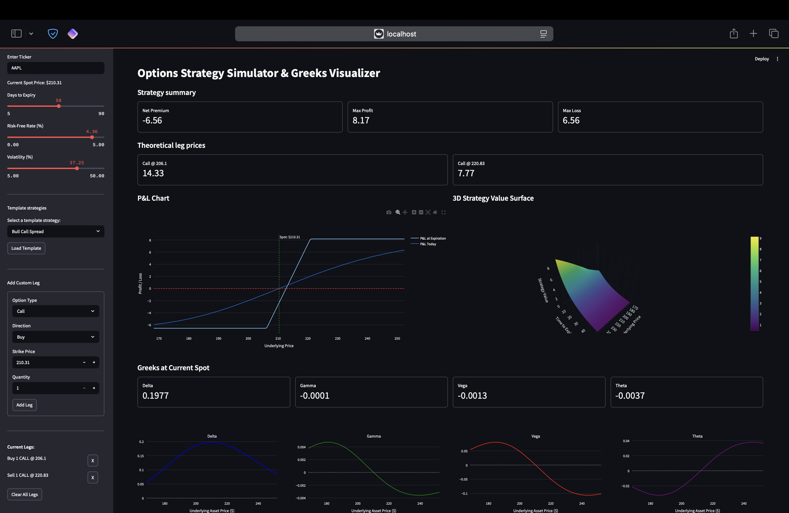

# Options Strategy Simulator & Greeks Visualizer

A Python-based web application for simulating multi-leg options strategies, visualizing payoffs, and analyzing key risk sensitivities (Greeks) across varying market conditions. Built with `Streamlit` and using a self-implemented Black-Scholes model for pricing and Greeks calculation.

## Features

- **Multi-Leg Strategy Builder**: Combine multiple calls and puts, both long and short, to create custom strategies.
- **Real-Time Market Inputs**:
  - **Spot Price**: Automatically retrieved from Yahoo Finance for any stock ticker.
  - **Volatility Slider**: Simulate changes in implied volatility and assess P&L impact.
  - **Risk-Free Rate Control**: Set interest rate to reflect real or hypothetical market conditions.
- **P&L Visualization**:
  - Payoff at expiration
  - Theoretical P&L today based on Black-Scholes valuation
- **Greeks Calculation**:
  - Compute Delta, Gamma, Theta, Vega, and Rho manually (no external libraries)
  - View their sensitivities across varying spot prices

## Screenshot



## Usage
```bash
streamlit run app.py
```

1. Option Legs: Each leg is defined by option type, strike, quantity, direction, and expiry.
2. Strategy Aggregation: All legs are priced and summed using the Black-Scholes model to compute net payoff and Greeks.
3. P&L Computation:
    - At Expiration: Based on intrinsic value minus initial strategy cost
    - Today: Based on Black-Scholes valuation minus initial cost
4. Greeks Calculation: Delta, Gamma, Vega, Theta, and Rho are computed manually using analytical derivatives of the Black-Scholes formula.
